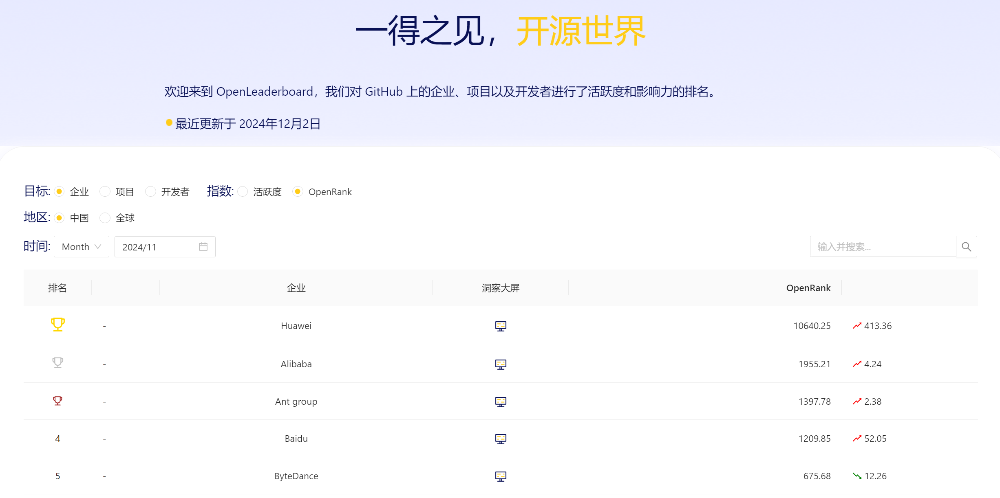
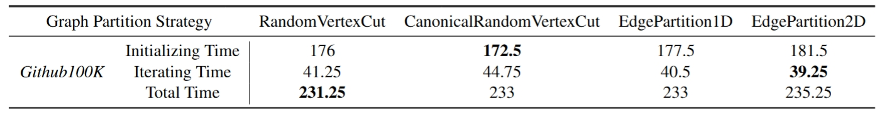
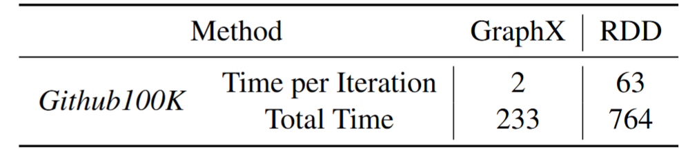

# **基于 Spark GraphX 的 Github 项目中心度算法实现**

## **1. 背景**

本项目旨在实现一个基于Spark GraphX的大规模数据处理应用，来处理[OpenDigger](https://github.com/X-lab2017/open-digger)项目中的项目关联度指标的相关计算内容，以提高计算效率。

**关于OpenRank指标**

PageRank算法是以Larry Page命名的，Google最著名的网页排序算法，此处不再赘述。经典的 PageRank 算法是进行有向无权图计算的一种算法，边是网页之间的链入关系。而在OpenDigger项目的背景中，经典的PageRank算法将面临两个问题：首先是各节点之间其实为无向，即项目之间的关联关系是相互的；其次是带权图，即每两个项目之间的关联度都存在一个量化指标，这个指标确定了两个项目之间的关联紧密程度；这导致了经典PageRank算法并不能直接适用。针对于此，OpenDigger作者提出了基于加权PageRank算法（[WPR算法](https://ieeexplore.ieee.org/document/1344743)）的OpenRank指标，其在经典的PageRank算法中引入了边权，即在迭代计算时，节点中心度的值不再平均分配到相邻节点，而是通过边权来确定分配比例。

---

## **2. 动机**

在OpenDigger项目中，作者通过计算OpenRank指标（基于加权PageRank算法），实现对GitHub全域同质网络图数据的分析，以评估各个GitHub项目与用户的活跃程度。而在计算OpenRank指标的过程中，使用单机环境会有较大的时间开销，故本项目尝试使用Spark图计算引擎开发对应的大规模数据处理应用，在多节点环境下完成指标计算，以提高计算效率缩短计算用时。

---

## **3. 实现方法**

### **3.1 技术选型**

Spark GraphX是Apache Spark的图计算组件，它提供了丰富的图处理API，可以方便地处理和分析大规模图数据。GraphX结合了图计算与数据并行处理的优势，使得在处理大规模图时既能保证性能又能保持灵活性，其在本项目中的主要优势有以下几点：

**数据处理性能**

Spark GraphX基于Spark的分布式计算框架，利用RDD实现数据的容错和并行计算，能够处理海量图数据，有效提升了处理大规模图数据的性能。而本项目处理的数据对象（GitHub全域日志数据）即为大规模复杂图数据，使用Spark GraphX可以有效提高其计算效率。

**可扩展性**

Spark GraphX拥有良好的可扩展性，对于大规模图数据，可以通过增加计算节点来扩展计算能力，满足项目需求。除此之外，Spark生态系统提供了与多种数据源的集成能力（如HDFS等）可以方便地将图数据存储在不同的数据源中，通过Spark GraphX进行计算。

**编程模型**

GraphX提供了丰富的图计算API，如Pregel API和Graph API，可以轻松地进行图的构建、变换和查询等操作，支持多种图算法的实现，在此处可以方便地实现加权PageRank算法的各个步骤。

--

### **3.2 实验设置**

**集群配置**

| workers | memory per woker | cpu per worker |      |
| ------- | ---------------- | -------------- | ---- |
| 3       | 16g              | 4 cores        |      |

**数据集**

采样 2015 年 Github 全域数据中十万个仓库的15天行为数据，节点为有过活跃度中定义行为的开发者和仓库，边为开发者和仓库之间的活跃信息。

| GitHub repo数目 | 图节点规模 | 图边规模 |
| --------------- | ---------- | -------- |
| 100000          | ≈100000    | ≈1000000 |

---

## **4. 实验结果及分析**

### **4.1 不同图分区策略对比**

和RDD自身`Partitioner`的传统策略不同，GraphX基于Vertex进行切分，保证不同的Parition里是不同的边，但同一个Vertex可以被切分到多个Parition中。所以GraphX在实现图分割时，通过`PartitionStrategy`定义下面四种策略：

| **分区策略**                 | **描述**                                                     | **优点**                                        | **缺点**                             | **适用的图算法**                                      |
| ---------------------------- | ------------------------------------------------------------ | ----------------------------------------------- | ------------------------------------ | ----------------------------------------------------- |
| **RandomVertexCut**          | 将边随机分布到多个分区中，边的两端顶点分配到同一分区。       | 简单直接，适合负载均衡。                        | 顶点副本可能较多，增加通信开销。     | 较简单的小图计算，如PageRank、Connected Components。  |
| **EdgePartition1D**          | 根据边的一个顶点（通常是源顶点）的哈希值进行分区。           | 方法简单，易于实现。                            | 分区可能不均衡，某些分区可能过载。   | 点分布均衡的图算法，如Triangle Counting。             |
| **EdgePartition2D**          | 使用二维网格分区策略，根据边的两个顶点所在的网格单元进行分区。 | 减少顶点副本数量，优化通信。                    | 分区计算复杂度较高，不适合小规模图。 | 大型图计算，如BFS、Shortest Path。                    |
| **CanonicalRandomVertexCut** | 对边的顶点以某种顺序（如顶点ID大小）标准化后分区。           | 减少顶点副本数量，相比RandomVertexCut优化通信。 | 仍然可能存在较高通信开销。           | 较简单的多次迭代算法，如PageRank、Label Propagation。 |

上图为GraphX不同的图分割策略的计算时间对比，单位为秒，重复运行四次取平均值。最优的时间用加粗表示。迭代时间为从开始迭代到算法收敛的时间。

**初始化时间的影响**

- Canonical Random Vertex Cut 在初始化时间上表现最佳（172.5秒），这表明其在分配初始数据时效率较高。可能是因为这种方法在顶点分配上更均匀，减少了初始数据分布的不均衡性。
- Edge Partition 2D 的初始化时间最长（181.5秒），可能是因为其在二维空间上进行分区，增加了初始计算的复杂性。

**迭代时间的影响**

- Edge Partition 2D 在迭代时间上表现最优（39.25秒），这可能得益于其在迭代过程中更好地利用了数据局部性，减少了跨分区通信。
- Canonical Random Vertex Cut 的迭代时间相对较长（44.75秒），可能是因为在迭代过程中需要处理更多的跨分区边。

**总时间的综合分析**

- Random Vertex Cut 和 Edge Partition 1D 的总时间相同（233秒），这表明在不同的分区策略下，初始化和迭代时间的权衡可能导致相似的总时间。
- Edge Partition 2D 的总时间最长（235.25秒），尽管其迭代时间最短，但初始化时间的增加抵消了迭代时间的优势。

### **4.2 GraphX **Pregel Api 实现与 RDD 手动实现对比

上表为基于不同实现方式的**单次**迭代时间以及总时间对比，GraphX为4种图分割方式各运行4次，取全局平均值；NaiveRDD为2次运行的均值，单位为秒。

**两种实现方式对比分析**

**存储结构**

- **GraphX** 通过 `EdgeTriplet` 结构，将顶点和边的属性紧密结合在一起，减少顶点和边之间的访问开销。
  - 在 Pregel 中，消息只需在边和顶点的本地进行交换，而不需要通过多次 `join` 操作来手动匹配顶点和边。
  - 这种数据局部性减少了通信和磁盘 IO 的开销。
- **RDD 实现** 中，由于顶点和边是分开存储的，每次迭代都需要显式地使用 `join` 来匹配顶点和边，这会导致大量的分布式数据传输和 shuffle 操作，降低性能。

**分区策略**

- GraphX 提供了专用的图分区策略（如 `EdgePartition` 和 `VertexPartition`），能够将与某些顶点和边相关的计算集中在同一个分区中，减少跨分区的数据通信。
  - **优势**：在分布式环境中，跨节点的通信开销通常是性能瓶颈。GraphX 的分区优化通过最小化跨分区边的数量显著提高了性能。
- **RDD 实现** 通常使用的是默认的键值对分区策略，对于图计算来说，这种策略不能有效地减少跨分区通信。

**计算框架**

- Pregel 是基于图的并行计算框架。它以顶点为中心进行计算，在迭代过程中，每个顶点只需要处理来自相邻顶点的消息，然后更新自己的状态，并将新的消息发送给相邻顶点。这种方式使得数据的处理更加局部化，减少了大量不必要的数据移动。

**小结**

与Naive RDD相比，GraphX有显著的效率提升，其优势主要是来自于迭代阶段。GraphX将顶点和边的属性结合在一起，减少了数据在不同节点之间的传输，这种数据局部性不仅减少了通信开销，还降低了磁盘 IO 的负担；而Naive RDD由于需要频繁的 join 操作，会导致大量的网络传输和数据洗牌，进而影响性能。

---

## 5. 分工

| **成员** | **分工**                     | **贡献度** |
| -------- | ---------------------------- | ---------- |
| 丁正源   | 环境部署、算法实现           | 25%        |
| 赵艺博   | 图分区策略实验、实验报告撰写 | 25%        |
| 何德鑫   | 实验分析、实验报告撰写       | 25%        |
| 闫一诺   | PPT制作与汇报                | 25%        |
